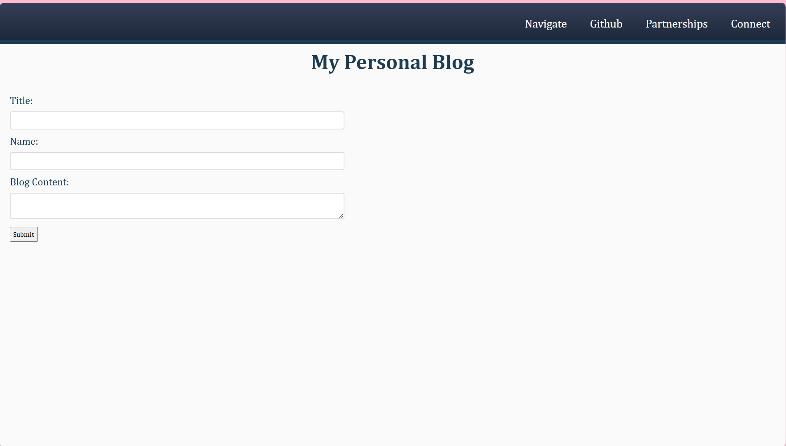
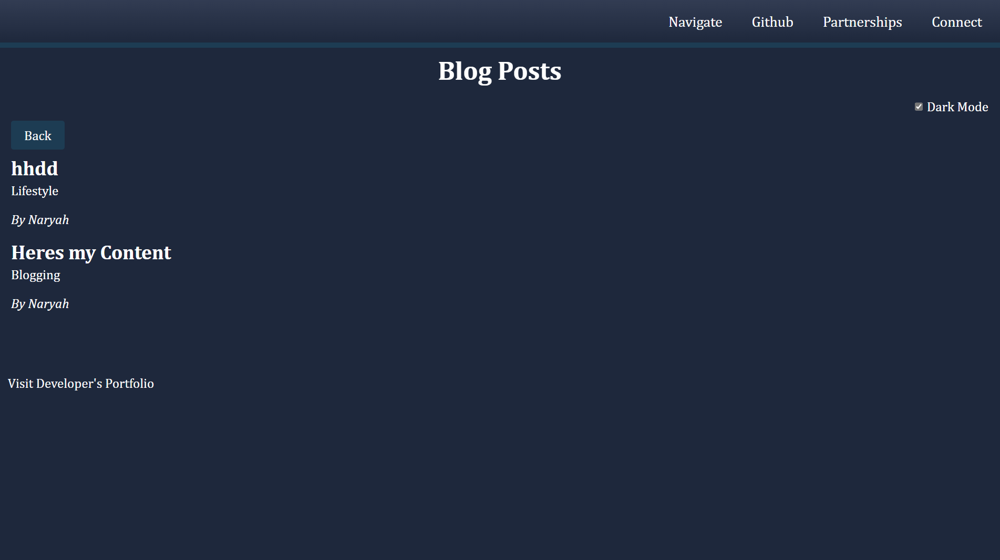

# Naryahs-Blog

## Description
This is a Personal Blog website built as part of the Web APIs Challenge. The site allows users to input their blog posts and view them on the same page. Additionally, it features a light/dark mode toggle to provide a customizable user experience. This project helped me gain hands-on experience with JavaScript, the Document Object Model (DOM), and web APIs, while also enhancing my skills in interactive web design.

## User Story 
AS A marketing student
I WANT a personal blog
SO THAT I can showcase my thoughts and experiences

### Links 
Git hub: https://github.com/NaryahA/Naryahs-Blog

### Screenshot 

